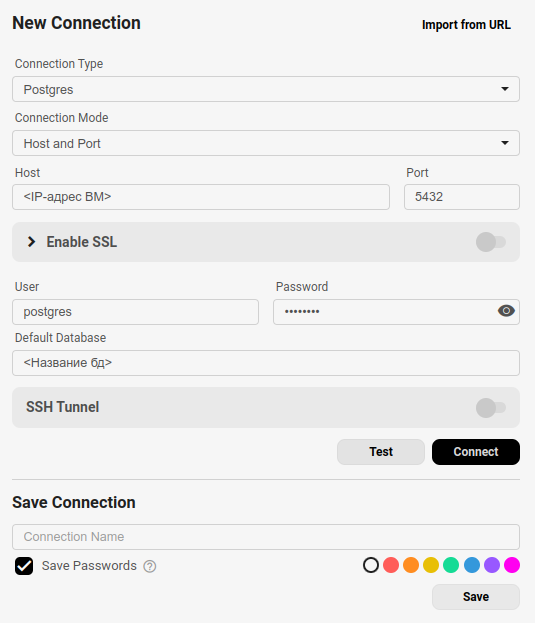

## Содержание

- [Содержание](#содержание)
- [Описание](#описание)
- [Инструкция по развёртыванию](#инструкция-по-развёртыванию)
	- [1. Установка системы виртуализации](#1-установка-системы-виртуализации)
	- [2. Загрузка образа](#2-загрузка-образа)
	- [3. Настройка сети](#3-настройка-сети)
	- [4. Создание виртуальной машины](#4-создание-виртуальной-машины)
	- [5. Конфигурация ssh](#5-конфигурация-ssh)
	- [6. Установка ПО и конфигурация](#6-установка-по-и-конфигурация)
	- [7. 1. Создание проекта в Proteus](#7-1-создание-проекта-в-proteus)
	- [7. 2. Написание программы](#7-2-написание-программы)
	- [8. Использование ESP32](#8-использование-esp32)
	- [9. Запуск MQTT-брокера](#9-запуск-mqtt-брокера)
	- [10. Написание скрипта записи](#10-написание-скрипта-записи)
	- [11. Настройка Grafana](#11-настройка-grafana)

___
## Описание

Данный проект представляет собой систему для визуализации данных с двух виртуальных датчиков температуры в Grafana, со средством хранения данных в виде базе данных PostgreSQL с использованием технологий виртуализации.


---
## Инструкция по развёртыванию

### 1. Установка системы виртуализации
В качестве системы виртуализации было использовано программное обеспечение Oracle VirtualBox версии 7.1.4

Установить данное ПО можно с официального сайта продукта, или же из репозиториев, если исопльзуется операционная система Linux.


___
### 2. Загрузка образа
Перед созданием виртуальных машин необходимо загрузить образ той операционной системы, которая будет использована для установки. В данном проекте было использованое 2 операционные системы семейства Linux - Ubuntu и Arch.

Загрузить образы также можно на официальном сайте операционной системы.


___
### 3. Настройка сети
Для развёртывания данного проекта было использовано 2 подхода сетевого взаимодействия между виртуальными машинами и компьютером-хостом: сетевой мост и NAT-сеть.

#### Сетевой мост
При использовании первого подхода IP-адрес виртуальной машины будет выделен DHCP-сервером роутера, машина будет иметь доступ в глобальную сеть, а также будет менее защищена.

#### NAT-сеть
Если же использовать NAT-сеть, то VirtualBox создаст новую локальную сеть, к которой будут подключаться виртуальные машины. В таком случае машины будут иметь доступ в интернет, но для подключения к ним из интернета или машины-хоста необходимо будет пробросить порты.

Для создания локальной сети в VirtualBox выберите пункт **Tools** и вкладку **NAT Networks**, после чего создайте здесь новую сеть. Здесь же находится интерфейс для проброса портов.

Конфигурация портов выглядит так:

| Name    | Protocol | Host IP | Host Port | Guest IP | Guest Port |
| ------- | -------- | ------- | --------- | -------- | ---------- |
| Grafana | TCP      |         | 3000      | 10.0.2.4 | 3000       |
| MQTT    | TCP      |         | 1883      | 10.0.2.5 | 1883       |
| Postgre | TCP      |         | 5432      | 10.0.2.5 | 5432       |
| SSH_4   | TCP      |         | 3024      | 10.0.2.4 | 22         |
| SSH_5   | TCP      |         | 3025      | 10.0.2.5 | 22         |

___
### 4. Создание виртуальной машины
Создайте новую виртуальную машину(далее - ВМ) в VirtualBox


Назовите её, выберите загруженный ранее образ диска ISO и укажите тип системы Linux, дистрибутив Ubuntu/Arch и разрядность. Не забудьте указать достаточный объём жёсткого диска во вкладке **Hard Disk**.

После создания не забудьте зайти в настройки новой виртуальной машины и задать настройки сети:


Запустите виртуальную машину и пройдите через все этапы процесса установки. После завершения введите команду
```bash
ip -br a
```

Если в результате вы видите IP-адрес подобного формата с устройством по типу *enp0s3*, следовательно машина успешно подключилась к сети
```bash
[ahardor@grafanaVM ~]$ ip -br a
lo               UNKNOWN        127.0.0.1/8 ::1/128 
enp0s3           UP             10.0.2.4/24 metric 100 fe80::a00:27ff:fe97:630f/64 
[ahardor@grafanaVM ~]$
```

Следующим шагом станет обновление пакетов, для этого введите команду, подходящюю для вашей операционной системы:

**Ubuntu**
```bash
sudo apt update
sudo apt upgrade
```

**Arch**
```bash
sudo pacman -Suy
```

Повторите эти же шаги, создав вторую виртуальную машину, либо же используйте инструмент клонирования виртуальной машины, однако не забудьте **сменить MAC-адрес** в настройках новой ВМ. Или же выберите политику относительно MAC-адресов при клонировании:


___
### 5. Конфигурация ssh

Первым шагом после установки станет настройка более удобного взаимодействия с ВМ посредством протокола **ssh**

Для этого небходимо сгенерировать ssh-ключ на вашей хост-системе. Если вы используете Linux, введите данную команду в терминал:

```bash
ssh-keygen -t rsa
```

Нажмите Enter, далее введите пароль(необязательно), после чего ключ будет успешно создан.

Чтобы увидеть ключ, запустите команду
```bash
cat ~/.ssh/id_rsa.pub
```

Для Windows сделайсте следующее:

Сначала зайдите в **Параметры -> Приложения -> Приложения и возможности** и выберите пункт *Дополнительные компоненты*


В открывшемся списке найдите пункт **OpenSSH**, если его нет, то нажмите **Добавить компонент** и установите его


Далее действия похожи на шаги в Linux:
```powershell
ssh-keygen
```

Нажмите Enter, далее введите пароль(необязательно), после чего ключ будет успешно создан.

Чтобы увидеть ключ, запустите команду
```powershell
type C:/Users/<ваш пользователь>/.ssh/id_rsa.pub
```

Данный ключ необходимо ввести в файл `authorized_keys` в виртуальной машине для быстрого доступа. Для этого установим консольный редактор текста, *`nano`* или *`micro`*

```bash
## Ubuntu
sudo apt install nano
sudo apt install micro

## Arch
sudo pacman -S nano
sudo pacman -S micro
```

`Nano` более простой, а также предустановлен почти в каждом дистрибутиве

`Micro` же более дружелюбен, позволяет использовать навигацию мышкой и имеет более удобные сочетания клавиш.

После установки введём команду
```bash
micro ~/.ssh/authorized_keys
```

Если возникла ошибка, вероятно в домашней папке нет директории ssh, создайте её комнадой:
```bash
mkdir ~/.ssh
```

После чего снова выполните предыдущую команду

Перед вами откроется интерфейс текстового редактора, куда вам надо скопировать ваш ключ посредством сочетания клавиш **Ctrl+Shift+V**, затем сохранить и закрыть файл. На Arch также потребуется запустить ssh-клиент:

```bash
sudo pacman -S openssh

sudo systemctl enable sshd

sudo systemctl start sshd
```

Теперь необходимо пробросить порт `22` на любой свободный порт машины-хоста, если используется NAT-сеть, и вы сможете подключаться к ВМ без использования окна VirtualBox посредством команды:

```bash
ssh <пользователь ВМ>@<IP-адрес ВМ> -p <порт>
```

IP-адрес ВМ вы можете узнать с помощью команды 
```bash
ip -br a
```

___
### 6. Установка ПО и конфигурация

Перейдём к установке необходимого ПО в лице **Grafana** и **PostgreSQL** на разные ВМ.

Для установки Grafana воспользуйтесь командой:
```bash
sudo apt install grafana -y ## Ubuntu

sudo pacman -S grafana ## Arch
```

После установки откройте файл конфигурации и уменьшите минимальное время обнолвения дашбордов до 1 секунды:

```bash
sudo micro /etc/grafana.ini
```

```ini
[dashboards]

	min_refresh_interval = 1s
```

После чего запустите сервис Графаны:

```bash
sudo systemctl enable grafana

sudo systemctl start grafana
```

Теперь на машине-хосте откройте ссылку с адресом вашей ВМ и портом 3000, либо ссылку http://localhost:3000, если вы пробрасывали порты и вы увидите интерфейс Grafana


Перейдём к установке PostgreSQL, запустите вторую виртуальную машину и введите команды для установки необходимых пакетов:

```bash
## Ubuntu
sudo apt install postgresql postgresql-contrib -y 

## Arch
sudo pacman -S postgresql postgresql-libs 
initdb -D /var/lib/postgres/data
```

После установки необходимо отредактировать файл конфигурации `pg_hba.conf`, чтобы разрешить подключения к базе данных по IP-адресу

```bash
sudo micro /etc/postgresql/16/main/pg_hba.conf ## Ubuntu

sudo micro /var/lib/postgres/data/pg_hba.conf ## Arch
```

Далее в конце файла вы увидите следующую конфигурацию:


Вам необходимо в пункте **IPv4 local connections:** добавить строку с содержанием IP-адреса вашего DHCP-сервера, скорее всего это будет `192.168.1.0/24` или же как на снимке выше - `10.0.2.2/24`, поскольку использована локальная NAT-сеть. Чтобы узнать данный адрес, воспользуйтесь командой `ipconfig` - для Windows или `ifconfig` - для Linux

Далее сохраните файл и запустите/перезапустите postgresql

```bash
sudo systemctl enable postgresql

sudo systemctl start postgresql ## или замените start на restart
```

Также можете сразу создать базу данных, чтобы далее настроить подключение только к ней:

```bash
sudo -u postgres psql ## Вход в PostgreSQL
```

```psql
psql> CREATE DATABASE "Название";

psql> \q
```

База создана, далее необходим графический клиент для работы с ней, который будет установлен на машину-хост. Для Windows установите `pgAdmin 4`, а для Linux лучше использовать `Beekeeper`

Добавьте новое подключение и укажите данные для входа:





После этого создайте таблицу с 3 полями: источник сигнала, температура и время показания


___
### 7. 1. Создание проекта в Proteus

Вы можете использовать настоящие компоненты, либо воспользоваться средой разработки и эмуляции микроконтроллера и компонентов - **`Proteus`** версии 8.11 Pro.

Установите данное ПО на операционную систему Windows 10/11, если вы используете Linux, создайте виртуальную машину с Windows.

**ВНИМАНИЕ!** Proteus необходимо запускать от имени Администратора!

Создайте новый проект и следуйте по этапам, ничего не меняя, на экране `Firmware` выставьте такие настройки:


Далее во второй вкладке **Visual Designer** нажмите правой клавишей на пункт `Peripherals` и добавьте:
 - 1шт VFP Server (ESP8266) `Вкладка Internet of Things`
 - 2шт Arduino DHT22 Humidity and Temperature Breakout Board `Вкладка Breakout Peripherals`
 
Затем вернитесь на первую вкладку **Schematic Capture**, вы увидите добавленные компоненты:


Вам необходимо найти порт, к которому подключаются датчики, он отмечен красной стрелкой на снимке сверху. У обоих датчиков порты будут одинаковые, необходимо переназначить порт у одного из них. Для этого дважды кликните по названию порта, появится окно, где вы можете выбрать другой порт:


Нажмите ОК и вернитесь на вторую вкладку

В левой части программы деактивируйте все элементы кроме *ESP1:MQTT(MQTT)* и 2 датчиков температуры, что мы добавили. Должно выглядеть так:


Пришёл черёд написания программы. В данном проекте это делается с помощью графических блоков.

___

### 7. 2. Написание программы

Изначально ваша программа будет выглядеть так:


Здесь мы можем увидеть два метода: `setup` и `loop`. Первый выполняется единожды, при запуске микроконтроллера, а второй зацикливается и начинает выполняться после завершения первого. Поэтому задание конфигураций, соединений и параметров выполняется в методе `setup`, а основная часть программы - в `loop`

Алгоритм программы будет следующим:
1. Контроллер подключается к брокеру по протоколу MQTT
2. Контроллер считывает данные с датчиков
3. Данные формируются в JSON
4. Данные отправляются на соответствующий *topic*
5. Далее следует задержка между считываниями

Таким образом, первый пункт будет выполняться в методе `setup`, а 2-5 в `loop`.

Для подключения к брокеру мы раскрываем пункт с MQTT в дереве компонентов слева и вытягиваем на основную часть экрана метод `connect`


Далее жмём на него дважды и устанавливаем параметру *Clean Session* значение `TRUE`.


Подключаем к данному блоку сверху и снизу стрелки из ключевых точек блоков `Setup` и `End`


Также слева в дереве нажмите дважды на пункт с MQTT и внизу появится окно настроек, выставьте настройки следующим образом:

| Configuration |                            |
| ------------- | -------------------------- |
| clientID      | ESP-32                     |
| server        | <IP-адрес ВМ с PostgreSQL> |
| port          | 1883                       |
| user          |                            |
| password      |                            |
| debug         | true                       |

Далее перейдем к методу `Loop`:

Откройте пункт с датчиком температуры в дереве слева:


И перетащите в основную часть метод `readTemperature`

Кликните по нему дважы, и в открывшемся окне создайте 2 переменные типа `float` для хранение температур датчиков, нажам на клавишу *New* 


После чего выберите одну из них в качестве переменной для записи в методе `readTemperature`


Сохраните результат, и теперь, для правдоподобности показаний, необходимо добавить элемент случайной генерации.
Добавьте элемент `Assignment Block` из колонны слева от программы:


И впишите в него следующую формулу:


Таким образом наша температура будет иметь отклонение до 5 градусов вверх или вниз.

Далее из дерева MQTT перетащите блок `Publish` и выставьте следующие параметры:


И в конце добавьте элемент `delay` и выставьте задержку, допустим в 1000мс, что равняется 1 секунде. Таким образом, данные будут отправляться каждую секунду.

Повторите данные действия и добавьте блоки чтения, изменения и отправки для второго датчика. В результате алгоритм метода `loop` будет выглядеть так:


Количество датчиков можно легко увеличить, для этого повторите предыдущие действия.


Программа же должна выглядеть примерно, как на рисунке ниже, обратите внимание что на нем приведена программа для 4 датчиков и у каждого свой ID, создавать новую переменную для каждого не обязательно.


Также обратите внимание на то, что при подключении нескольких датчиков у них должны отличаться порты I/O, поменять их можно кликнув по ним два раза. Количество датчиков будет ограничено возможностями выбранной по умолчанию для проекта платы Arduino UNO.

На этом программирование прошивки завершено, однако перед запуском необходимо проделать ещё несколько операций.

___

### 8. Использование ESP32

#### **Требуемое оборудование**

1. Микроконтроллер ESP32 WROOM-DA Module.

2. Датчик температуры DS18B20 – 2 штуки.

3. Резистор на 3-5 кОм.

Для разработки программ для ESP32 и прошивки микроконтроллера ESP32 требуется программатор и компилятор. В данной инструкции предлагается использовать интегрированную среду разработки Arduino IDE.

#### **Установка** **Arduino** **IDE** **на ОС** **Windows**

1. Переходим на сайт [https://www.arduino.cc/en/software](https://www.arduino.cc/en/software) и выбираем [_Windows Win 10 and newer, 64 bits_](https://downloads.arduino.cc/arduino-ide/arduino-ide_2.3.3_Windows_64bit.exe "Windows Win 10 and newer, 64 bits").

2. Запустить скачанный _.__exe_ и следуя пунктам установить Arduino IDE.

3. После установки Arduino IDE возможно будет предложено установить дополнительные драйвера – соглашаемся на установку драйверов.

#### **Установка** **Arduino** **IDE** **на ОС** **Ubuntu**

1. Переходим на сайт [https://www.arduino.cc/en/software](https://www.arduino.cc/en/software) и выбираем _Linux_ _ZIP_ _File_

2. Добавляем своего пользователя в группу dialout, используя команду _sudo_ _addgroup_ _$__USERNAME_ _dialout_

3. Распаковываем архив с загруженной Arduino IDE, и запускаем IDE перейдя в директорию с распакованным архивом и выполняя в консоли команду _./__arduino_____ide_

#### **Установка необходимых библиотек в** **Arduino** **IDE** **для** **ESP** **32**

1. После запуска IDE необходимо открыть _Boards_ _manager_, для этого выбираем в меню _Tools – Board – Boards Manager_, в строке поиска вводим ESP32, и устанавливаем пакет _esp32 by Espressif Systems_.

2. После установки выбираем `Tools–>Board->Esp 32->ESP32-WROOM-DA Module` (если вы используете другую версию МК, то выбирайте её).

3. Устанавливаем библиотеки _OneWire_, _DallasTemperature_, _PubSubClient_. Для этого открываем _Sketch_ _–_ _Include_ _library_ _–_ _Library_ _manager_ и в поиске вводим названия требуемых библиотек.

#### **Подготовка и прошивка** **ESP 32**

1. Загружаем репозиторий [https://github.com/jewcomm/IIoT.git](https://github.com/jewcomm/IIoT.git)
2. Открываем Arduino IDE и открываем в нем файл `finder.ino` (файлы прошивки могут  быть найдены в этом же репозитории, либо по [адресу](https://github.com/jewcomm/IIoT/blob/main/finder.ino "finder.ino"))

_Примечание: датчики_ *DS_18_B_20* передают значения в цифровом формате, и каждый датчик имеет свой уникальный_ _ID__, которые требуется определить самостоятельно, если не знаете их заранее. Если_ _ID_ _известны – подключите датчики в соответствии с пунктом 3 и можете перейти к пункту 7._

3. Вывод DAT одного из датчиков DS18B20 подключаем к 15 выводу ESP32 используя следующую схему подключения:


GND следует подключить к GND микроконтроллера, VDD к VDD соответственно. Между DAT и VDD следует установить резистор на 4.7 кОм (допускается установка резистора номиналом от 3 кОм до 5 кОм).

4. ESP32 подключаем к ПК при помощи USB кабеля и нажимаем кнопку _Load_

5. После прошивки следует открыть _Tools_ _–_ _Serial_ _Monitor_, в нем отобразится ID датчика, который следует сохранить – он потребуется в дальнейшем.


_Примечание: на скриншоте выше указано по три адреса в строке, так как подключены сразу три датчика._

6. Повторяем пункт 3 для остальных датчиков, перепрошивать при этом МК не требуется, но лучше отключить МК от ПК при отключении / подключении любой периферии.

7. После того как ID всех датчиков будут сохранены, подключаем сразу все датчики, и переходим к пункту 8.

Схема, которая должна получиться после подключения всех датчиков изображена далее.


_Примечание: расположение контактов на вашем МК может отличаться от примера._

8. Загружаем скетч из репозитория `arduino_sw.ino` в Arduino IDE и редактируем следующие поля:

```ini

ssid – имя WiFi сети к которой будет подключен ESP32 и ПК с виртуальными машинами;

password – пароль от WiFi сети;

mqtt_server – IP адрес ПК на котором будут развернуты ВМ;

mqtt_topic_temp* - имена MQTT топиков в которые будут отправлять данные с датчиков;

sensor_temp* - ID датчиков, которые получили в пункте 5.
```

9. После внесения правок прошиваем (см. п. 4) ESP32 получившимся скетчем.

___

### 9. Запуск MQTT-брокера

Для корректной работы протокола MQTT необходима программа-брокер, что будет заниматься маршрутизацией сообщений по топикам. Для этого мы воспользуемся брокером **Mosquitto** и установим его на ВМ с PostgreSQL:

Впишите в терминал следующую команду:

```bash
sudo apt install mosquitto -y ## Ubuntu

sudo pacman -S mosquitto
```

После установки необходимо изменить конфигурацию, чтобы разрешить подключения, для этого откройте файл `/etc/mosquitto/mosquitto.conf` и впишите в него следующие строки:

```ini
allow_anonymous true
bind_address 0.0.0.0
```

После чего запустите Mosquitto:

```bash
sudo systemctl enable mosquitto

sudo systemctl start mosquitto
```

Осталось лишь написать скрипт, что будет получать данные из брокера и записывать их в базу данных.

___

### 10. Написание скрипта записи

Можете написать скрипт на любом языке, которым владеете, в качестве примера в репозитории будут приведены скрипты на Python и Dart.

После этого запустите скрипт, и в программе **Proteus** запустите нашу программу с помощью кнопки в левом нижнем углу:


Через некоторое время у нас будет достаточно данных для визуализации

___

### 11. Настройка Grafana

Заключительным этапом станет создание дашбордов в Grafana для отображения наших данных.

Начнём с добавления источника - базы данных. Выберите слева пункт `Data Sources` и добавьте новый источник - `PostgreSQL`


Далее создайте первый дашборд, зайдите в его настройки через иконку в виде шестерёнки в верхней панели справа, далее проследуйте во вкладку **Variables** и создайте новую переменную с такими параметрами:


Данная переменная позволит нам переключать данные с датчиков и смотреть те, что нам нужны.

Далее создайте визуализацию и в качестве SQL-запроса пропишите следующее:


```SQL
SELECT source_id, $__timeGroupAlias(timestamp::timestamp at time zone 'MSK', '30s'), avg(temp) as value FROM temp WHERE source_id IN ($Source)

GROUP BY time, source_id;
```

Он позволит получить данные из базы данных и отобразить их в виде графика.

Добавьте второй SQL-запрос и пропишите туда следующее:

```SQL
SELECT avg(temp) filter (where source_id = '1') as avg_1, avg(temp) filter (where source_id = '2') as avg_2 FROM temp;
```

Благодаря ему мы получим средние значения температур для разных датчиков

Во второй вкладке - `Transform Data` добавьте следующие функции:


Первый разделит полученные данные по датчикам, а второй отобразит средние значение в виде пунктирных линий.

В итоге вы должны получить следующий график:


Далее добавьте ещё 2 визуализации типа `Gauge` и настройте их на отображение последних значений температуры по 2 датчикам и средних значений температуры.


Финальная картина должна выглядеть так:

